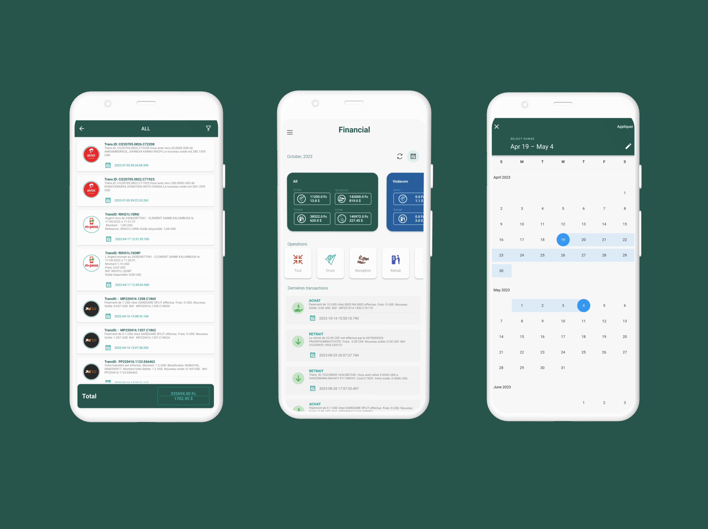

<h1 align="center">
   
   
    Financial
   
</h1>

<h4 align="center">Financial: Track your mobile money transactions.</h4>

<!-- 

  [Project's badges]

 -->

  <a href="#about">About</a> •
  <a href="#key-features">Key Features</a> •
  <!-- <a href="#getting-started">Getting Started</a> • -->
  <!-- <a href="#faq">FAQ</a> • -->
  <a href="#status">Status</a> •
  <!-- <a href="#license">License</a> -->

## About

A mobile app that consolidates mobile money transactions from Airtel Money, Orange Money, and Mpesa, providing users with a holistic view of their finances and enabling informed financial decisions.

## Screens

- Dashboard
- Transactions lists by type
- Filters transactions
- Export data to csv file

## Status

- Finished
<!-- ## Main screens

1. Login

2. Product

3. Payment

4. Profil
 -->

## You may also like...

List of apps or libs that do similar stuff as your project.

- [Delicious Food](https://github.com/Moise-Nturubika/Delicious-Food-App)
- [PharmaKit](https://gist.github.com/DomPizzie/7a5ff55ffa9081f2de27c315f5018afc)

---

> [!NOTE]  
> Due to an incident involving the unauthorized use of a brand logo in one of my applications, I have been temporarily banned from the Play Store. While resolving this situation, I have decided to publish my applications on GitHub to continue building my portfolio and allow recruiters to evaluate my work.

---
<!-- > [Moïse Nturubika](https://github.com/Moise-Nturubika) &nbsp;&middot;&nbsp; -->
> GitHub [@moise-nturubika](https://github.com/Moise-Nturubika) &nbsp;&middot;&nbsp;
> Twitter [@moise-nturubika](https://twitter.com/moise-nturubika)